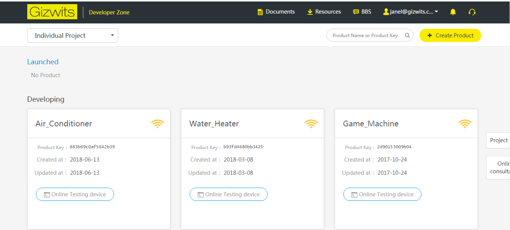
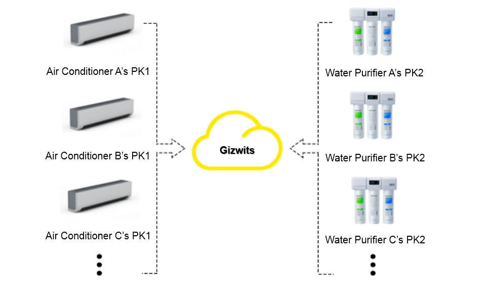
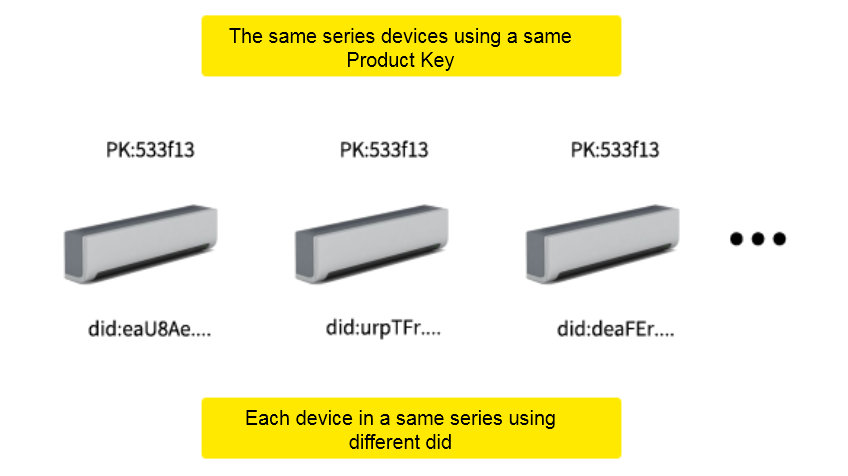
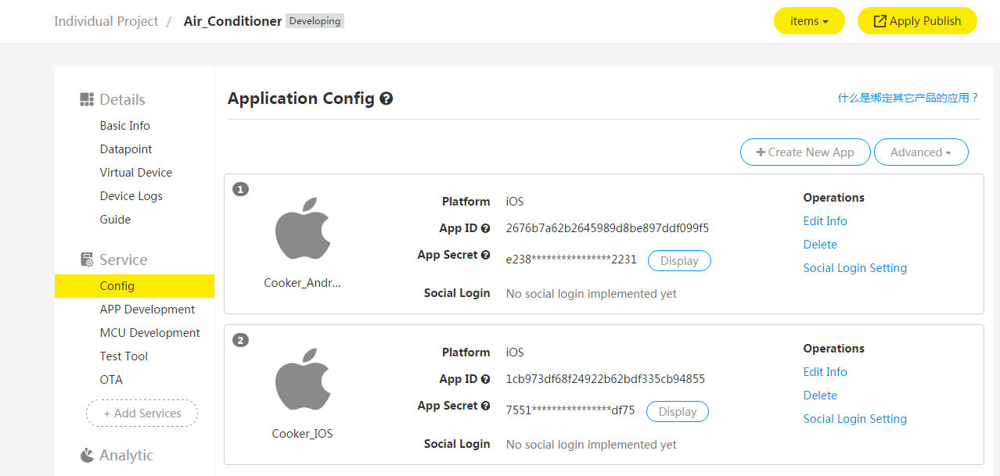
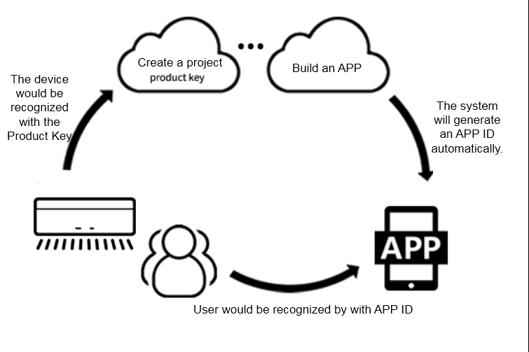
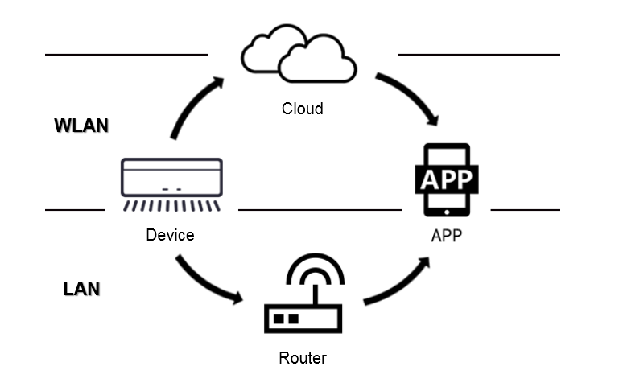
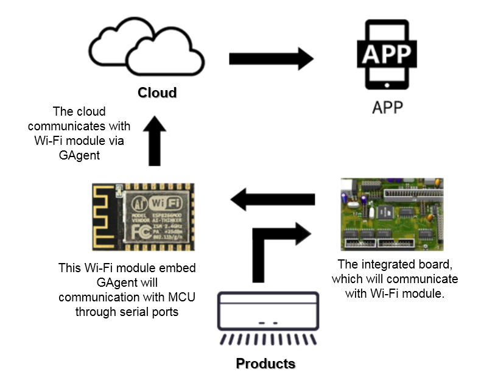
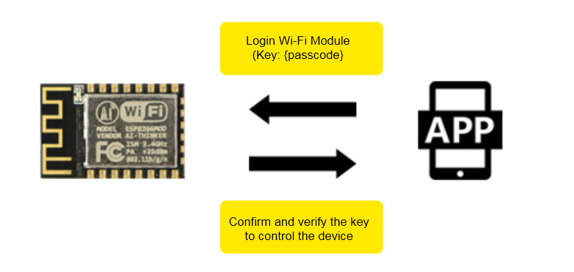
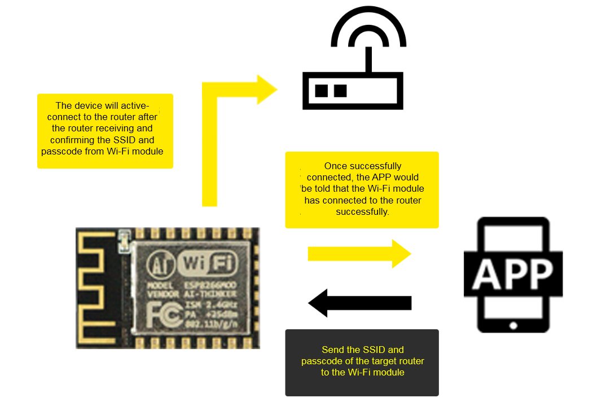

title: Glossary
---

This document defines and explains the terms related to Gizwits. If you encounter some terms that are not well understood during the development, you can refer to this document.

# Term definitions of cloud side

## 1. ProductKey 

Definition: product identification code, a 32 characters long string that is automatically generated by the developer after creating a new product in Gizwits cloud. It is a unique code in the database of Gizwits cloud. After the developer writes the ProductKey to the device master MCU, the Gizwits identifies the device through this code and automatically completes the registration.

Explanation: The premise for the device to access Gizwits cloud is that it needs the cloud to identify this device. Productkey is an important parameter for the device to access Gizwits. The basic meaning of this parameter is: a device identification code. For example, a company produces air conditioners, water heaters, which are two different types of devices. Thus both of them require the Productkey parameter in order to connect to Gizwits Cloud. This parameter, which can be viewed on the Gizwits official website, will be used during the development on MCU. See the following figure:

 
The role of Productkey in the development:

 
## 2. Product Secret

Definition: product secret key. When the Productkey is generated, the cloud generates a corresponding Product Secret. This parameter is a key confidential parameter and should not be disclosed to third parties. This parameter is used when binding remote devices (generally for GPRS access schema).

## 3. DID

Definition: device code. When a device is connected to Gizwits for the first time, Gizwits automatically registers this device based on its ProductKey and Wi-Fi module MAC address. DID which is used to associate with users and perform subsequent operations, should be unique across the entire network.

 
## 4. AppID

Definition: application identification code. When you need to develop an application (including iOS, Android, Web application, etc.) for a smart device, an AppID is automatically generated in Gizwits cloud and associated with the device. This AppID is required for application development.

Explanation: When creating a product in the cloud, you need to add an application under the product. To build an App on both Android and iOS requires creating separate applications. AppID is mainly used when developing APP, and all users registered in the App are associated with this Appid. See Gizwits official website.

 
 
## 5. App Secret
Definition: application secret key. An App Secret will be generated when the AppID is created in the cloud. This parameter is required when registering a mobile phone user on the APP side using SDK to obtain the SMS verification code.

## 6. Micro Cycle

Definition: establishing connections between smart devices and mobile phones, smart devices and smart devices via the same router to achieve WLAN communication (status check or control), which is called a Micro Cycle.

## 7. Macro Cycle

Definition: Smart devices access the Internet via routers to accomplish remote monitoring and control by users, which is called a Macro Cycle.

 
# Term definitions of device side

## 1. Gagent

Definition: The full name is Gizwits Agent, which runs on Wi-Fi modules, and through which devices access the Gizwits server. Currently, it is compatible with mainstream Wi-Fi modules of China. Developers can also implement their own custom modules to access Gizwits using the GAgent secondary development package provided by Gizwits.

Explanation: Gagent is an application program that runs on the Wi-Fi module. Gagent's main role is to make Wi-Fi modules connect to the Gizwits server and achieve TCP/UDP communication with the cloud. Therefore, after integrating the Wi-Fi module on the control board of the developer's product, only the implementation of serial communication between the control board and the Wi-Fi module is needed to connect to the Gizwits server directly without processing the underlying network transmission, as is showed in the picture: 

## 2. PassCode

Definition: Device Pass Code, used to verify the user's binding/control permission. When the user initiates a device binding, the device pass code can be obtained by users with legal means to bind the device and perform operations such as device status check and control during the valid period. GAgent generates a random number as a device pass when it is first run. It is generated and stored in non-volatile memory. When the device goes online, it needs to be reported to the server.

 
## 3. Onboarding

Definition: network access configuration, the process of connecting a Wi-Fi-based IoT device to a router is called Onboarding. When the new device is used for the first time, it needs to know the router's SSID and password to connect to the Internet via the router. Since most IoT devices do not have their own screens and keyboards, it is necessary to send the router's SSID and password to the device through a smart phone. The network access SDK for Wi-Fi devices provided by Gizwits has such built-in configuration function.

 
## 4. Station mode

Station mode (referred to as STA), is similar to a wireless terminal. STA itself does not accept wireless access and it can connect to the AP. Wireless network adapter is working in this mode generally.

## 5. AP mode

AP mode: Access Point, provides wireless access service, allowing other wireless devices to access, and providing data access. Wireless routers / bridges work in this mode generally. APs are allowed to connect to each other.

## 6. AirLink

Definition: collectively, the features of UDP broadcast messages that allow you to configure the network access for devices, such as SmartConfig and SmartLink, are called AirLink. It provides the standard onboarding operation procedures with a good user experience, which is compatible with configuration protocols from multiple Wi-Fi module manufacturers. The network access SDK for Wi-Fi devices provided by Gizwits has built-in AirLink function. 

## 7. SoftAP

Definition: Because each Smart Config protocol from different Wi-Fi module manufacturers is not fully mature and neither does it support 5G router signal. Gizwits has provided AirLink configuration mode and also supports SoftAP mode to configure devices to access routers. When a device enters the SoftAP configuration mode, the device itself becomes an AP, and the smart phone can directly connect to the device. Then the SSID and password of the router are input on the mobile phone and sent to the device which will automatically switch to the normal mode and try to connect to the router. 
